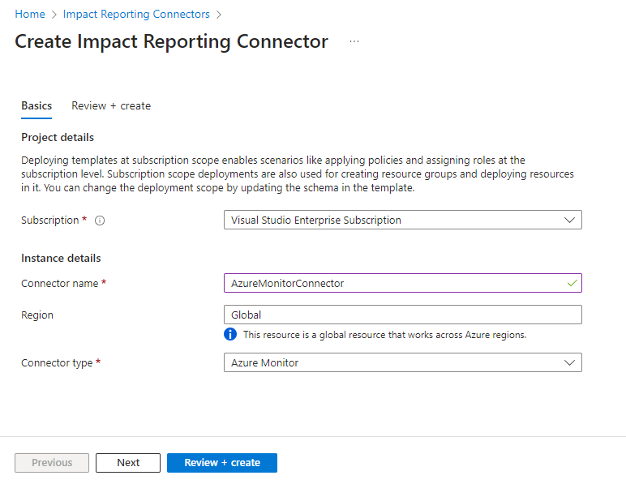
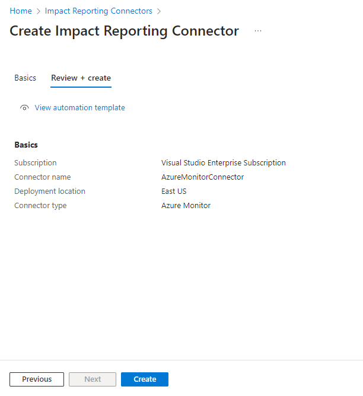

# Create an Impact Connector for Azure Monitor Alerts (Preview)
> [!IMPORTANT]
> Azure Impact Reporting is currently in PREVIEW. See the [Supplemental Terms of Use for Microsoft Azure Previews](https://azure.microsoft.com/support/legal/preview-supplemental-terms/) for legal terms that apply to Azure features that are in beta, preview, or otherwise not yet released into general availability.

## Pre-Requisites
| Type     | Details      |
| ------------- | ------------- |
| **Azure RBAC Permissions** | [Owner](https://learn.microsoft.com/azure/role-based-access-control/built-in-roles) or [User Access Administrator](https://learn.microsoft.com/azure/role-based-access-control/built-in-roles) to give the Connector Alerts Reader role. Contributor access to the subscription for provider registration and to enable connector features, create connector resources. |
| **Command line tools** | [Bash](https://learn.microsoft.com/en-us/cli/azure) or [PowerShell](https://learn.microsoft.com/en-us/powershell/azure) (*not needed if you're using CloudShell*)|
| **Subscription Id**| A subscription ID, or a file containing a list of subscription IDs  whose alerts are of interest|

## Create an Impact Reporting Connector
#### [Command Line](#tab/cli/)

Here's what deployment scripts do:
* Registers your subscriptions for Azure Impact Reporting private preview (prerequisite for using Connectors)
* Creates a connector resource (`microsoft.impact/connector`)
* This connector reports an impact whenever an alert from those subscriptions fires

##### 1. **Get the script**
Go to the [Impact Reporting samples](https://github.com/Azure/impact-reporting-samples/tree/main/Onboarding/Connector/Scripts) GitHub repo and choose your script and choose either the bash or PowerShell script
##### 2. **Execute in your environment**
You need to execute this script in your Azure environment.

###### **Powershell**
* Single Subscription: `./CreateImpactReportingConnector.ps1 -SubscriptionId <subid>`
* Multiple subscriptions from file: `./CreateImpactReportingConnector.ps1 -FilePath './subscription_ids'`

###### **Bash**
* Single Subscription: `./create-impact-reporting-connector.sh --subscription-id <subid>`
* Multiple subscriptions from file: `./create-impact-reporting-connector.sh --file_path './subscription_ids'`

#### [Portal](#tab/portal/)

1. Search for **Impact Reporting Connectors** in Azure portal search
2. Select on the **Create** button on the left side in the page. The **Create Impact Reporting Connector** page opens

    

3. From the **Subscription** drop down, select the subscription for the Connector
4. Under **Instance details**, enter *AzureMonitorConnector* for the **Connector name** and choose *AzureMonitor* for the **Connector type**.
5. Select the **Review + create** button at the bottom of the page
6. Once validated and the **Review + Create** tab shows no error, create the connector

    

7. The deployment can take several minutes to complete, as there are feature flags that need registration which can take some time to propagate. Meanwhile, head to the next section to enable alert reading from your subscription

---

## Assigning Azure-Alerts-Reader-Role to the Connector

1. Navigate to your subscription, and select **Access Control (IAM)** from the navigation blade
2. Select **Add** and then select **Add role assignment**.
3. On the **Add role assignment** page under the **Role** tab, in the search bar, type *Azure-Alerts-Reader-Role*. If this role doesn't exist, head to [Creating the Azure-Alerts-Reader-Role](#creating-the-azure-alerts-reader-role) to create this role. Once the role is created, return back to this step.

    

4. Select the *Azure-Alerts-Reader-Role* and select on **Next** button at the bottom of the page
5. Under the **Members** tab, select **User, group, or service principal** for **Assign access to**.
6. Select on **Select members**, which opens the **Select Members** blade on the right side.
7. Enter **AzureImpactReportingConnector** in the search bar, and select on the AzureImpactReportingConnector application. Then select **Select** button.

    

8. Select the **Review + assign** button at the bottom of the page
9. In the **Review + assign** tab, select on **Review + assign** button at the bottom of the page

## Creating the Azure-Alerts-Reader-Role
1. Navigate to your subscription, and select **Access Control (IAM)** from the navigation blade
2. Click **Add** and then select **Add custom role** to open the **Create a custom role** page

    

3. Under the **Basics** tab, enter the name **Azure-Alerts-Reader-Role** for the **Custom role name**. Leave others as defaults and select on **Next** on the bottom of the page

    

4. Under the **Permissions** tab, select on **Add permissions**.

    

5. Enter *Microsoft.AlertsManagement/alerts/read* in the search bar

    

6. Select the tile **Microsoft.AlertsManagement** to access the **Microsoft.AlertsManagement permissions** blade. Select the permission: **Read: Read alerts**, then **Add**

    

7. Select the **Review + create** button at the bottom of the page
8. In the **Review + create** tab, select on **Create** button at the bottom of the page

## Troubleshooting

### Connector deployment fails to due to permission errors

Ensure you have **Contributor** permission to log into Azure, register resource providers, and create connectors in the Azure subscriptions.

### Custom role assignment fails to due to permission errors

You also need to have [Owner](https://learn.microsoft.com/azure/role-based-access-control/built-in-roles) or [User Access Administrator](https://learn.microsoft.com/azure/role-based-access-control/built-in-roles) role to create and assign custom roles.

### Connector creation takes too long

It may take 15-20 minutes for the namespace registration to allow the connector resource creation to take place. 
If the script execution isn't complete after 30 minutes, cancel the execution and rerun it. If this issue persists, reach out to the [Impact Reporting Connectors team](mailto:impactrp-preview@microsoft.com)

## Next steps
* [What is an Impact Reporting Connector for Azure Monitor Alerts?](AzMonConnector.md)
* [Impact Reporting Connectors - Troubleshooting Guide](TSGConnectors.md)
* [View Reported Impacts and Insights](ViewImpactInsights.md)
