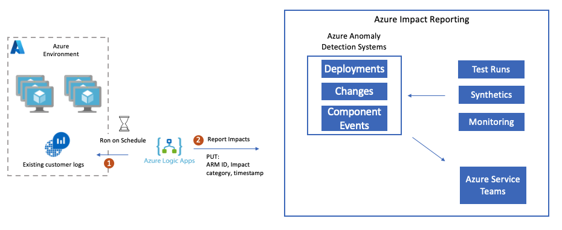

# Report Impacts Using a Logic App (Preview)
> [!IMPORTANT]
> Azure Impact Reporting is currently in Preview. See the [Supplemental Terms of Use for Microsoft Azure Previews](https://azure.microsoft.com/support/legal/preview-supplemental-terms/) for legal terms that apply to Azure features that are in beta, preview, or otherwise not yet released into general availability.

> [!NOTE]
> Please visit the [API Docs](https://aka.ms/ImpactRP/APIDocs) to learn more about available impact management actions.

Use a Logic App as REST client for impact reporting.



## Prerequisites

A managed identity with PUT access to the ImpactRP API and read access to the data source for the workload is required. Additionally, a query with a 1 minute or greater polling interval for the data source to generate the following fields is needed:

- ImpactName
- ImpactStartTime
- ImpactedResourceId
- WorkloadContext
- ImpactCategory

This guide uses a Kusto cluster as an example data source with the following query:

```kusto
ExampleTable
| where Status =~ "BAD" and ingestion_time() > ago(1m)
| distinct  ImpactStartTime=TimeStamp, ImpactedResourceId=ResourceId, WorkloadContext=Feature, ImpactCategory="Resource.Availability", ImpactName = hash_sha1(strcat(TimeStamp, ResourceId , Feature, Computer, ingestion_time()))
```

> [!NOTE]
> Please replace the query with one to a datastore or source that is supported by Logic Apps and returns the same columns. If all of these columns are not readily available, additional steps must be added to the workflow to generate the missing fields.

## Steps

1. Create a new Logic Apps in Azure portal with the following settings:
    - Publish: Workflow
    - Region: Central US
    - Plan: Standard

2. (Optional) Under the "Monitoring" section, set "Enable Application Insights" to "Yes." to enable failure monitoring. More steps are at the bottom of this document.

3. Review and Create the Logic App. Once created, open the Logic App and navigate to "Settings" -> "Identity" in the side pane. In the "User assigned" section, select "Add" and select the managed identity created in the prerequisites. Select "Save" to save the changes.

4. Navigate to "Workflows" -> "Connections" and select the "JSON View" tab. Create a connection for your data source. This example uses Kusto with managed identity, but any data source supported by Logic Apps can be used:

    ```json
    {
        "managedApiConnections": {
            "kusto": {
                "api": {
                    "id": "/subscriptions/<subscription_id>/providers/Microsoft.Web/locations/<region>/managedApis/kusto"
                },
                "authentication": {
                    "type": "ManagedServiceIdentity"
                },
                "connection": {
                    "id": "/subscriptions/<subscription_id>/resourceGroups/<rg_name/providers/Microsoft.Web/connections/<connection_name>"
                },
                "connectionProperties": {
                    "authentication": {
                        "audience": "https://kusto.kustomfa.windows.net",
                        "identity": "/subscriptions/<subscription_id>/resourcegroups/<rg_name>/providers/Microsoft.ManagedIdentity/userAssignedIdentities/<managed_identity_name>",
                        "type": "ManagedServiceIdentity"
                    }
                },
                "connectionRuntimeUrl": "<kusto_connection_runtime_url>"
            }
        }
    }
    ```

    Select "Save" to save the changes.

5. Navigate to "Workflows" -> "Workflows," then select "Add" and create and new blank workflow with "State Type" set as "Stateful."

6. Select the newly created workflow. Navigate to "Developer" -> "Code" and replace the JSON content with:

    ```json
    {
        "definition": {
            "$schema": "https://schema.management.azure.com/providers/Microsoft.Logic/schemas/2016-06-01/workflowdefinition.json#",
            "actions": {
                "For_each": {
                    "actions": {
                        "HTTP": {
                            "inputs": {
                                "authentication": {
                                    "identity": "/subscriptions/<subscription_id>/resourcegroups/<rg_name>/providers/Microsoft.ManagedIdentity/userAssignedIdentities/<managed_identity_name>",,
                                    "type": "ManagedServiceIdentity"
                                },
                                "body": {
                                    "properties": {
                                        "endDateTime": null,
                                        "impactCategory": "@{items('For_each')?['ImpactCategory']}",
                                        "impactedResourceId": "@{items('For_each')?['ImpactedResourceId']}",
                                        "startDateTime": "@{items('For_each')?['ImpactStartTime']}",
                                        "workload": {
                                            "context": "@{items('For_each')?['WorkloadContext']}"
                                        }
                                    }
                                },
                                "method": "PUT",
                                "retryPolicy": {
                                    "count": 5,
                                    "interval": "PT30M",
                                    "maximumInterval": "PT24H",
                                    "minimumInterval": "PT30M",
                                    "type": "exponential"
                                },
                                "uri": "@{concat('https://management.azure.com/subscriptions/', split(item().ImpactedResourceId, '/')[2], '/providers/Microsoft.Impact/workloadImpacts/', item().ImpactName, '?api-version=2022-11-01-preview')}"
                            },
                            "runAfter": {},
                            "type": "Http"
                        }
                    },
                    "foreach": "@body('Run_KQL_query')?['value']",
                    "runAfter": {
                        "Run_KQL_query": [
                            "Succeeded"
                        ]
                    },
                    "type": "Foreach"
                },
                "Run_KQL_query": {
                    "inputs": {
                        "body": {
                            "cluster": "https://examplecluster.eastus.kusto.windows.net/",
                            "csl": "ExampleTable\n|where Status =~ \"BAD\" and ingestion_time()>ago(1m)\n|distinct  ImpactStartTime=TimeStamp, ImpactedResourceId=ResourceId, WorkloadContext=Feature, ImpactCategory=\"Resource.Availability\", ImpactName = hash_sha1(strcat(TimeStamp, ResourceId , Feature, Computer, ingestion_time()))",
                            "db": "exampledb"
                        },
                        "host": {
                            "connection": {
                                "referenceName": "kusto"
                            }
                        },
                        "method": "post",
                        "path": "/ListKustoResults/false"
                    },
                    "runAfter": {},
                    "type": "ApiConnection"
                }
            },
            "contentVersion": "1.0.0.0",
            "outputs": {},
            "triggers": {
                "Recurrence": {
                    "recurrence": {
                        "frequency": "Minute",
                        "interval": 1
                    },
                    "type": "Recurrence"
                }
            }
        },
        "kind": "Stateful"
    }
    ```

    Select "Save" to save the changes.

7. Navigate to "Developer" -> "Designer." Select the "Run KQL (Kusto Query Language) Query" block. Replace "Cluster URL" and "Database" with the target Kusto cluster and database. Replace the "Query" with the query from the prerequisites. Next, select the blue "Change connection" link underneath the query textbox. Set "Authentication" to Managed Identity and set "Managed identity" to the managed identity created in the prerequisites with an appropriate "Connection Name" and select "Create."

    > [!NOTE]
    > If using a source other than Kusto, replace the "Run KQL Query" block with the appropriate block for your data source. The "For Each" block will need to be updated to iterate over the results of the query and the "HTTP" block will need to be updated to use the appropriate data from the query results.

8. (Optional) If the polling interval for the query is greater than 1 minute, select the "Recurrence" block and set the "Interval" to the polling interval in minutes.

9. Select the "HTTP" block and update the "Authentication" to the managed identity created in the prerequisites. Select "Save" to save the changes.

10. Navigate to "Overview" and select "Run" to test the flow. Results are displayed under "Run History."

11. (Optional) Return to the Logic App screen in Azure portal. Navigate to "Settings" -> "Application Insights" and select the hyperlink to the Application Insights resource. Navigate to "Monitoring" -> "Alerts." Select "Create" -> "Alert Rule." From here, you can create an alert rule to notify on failures.
