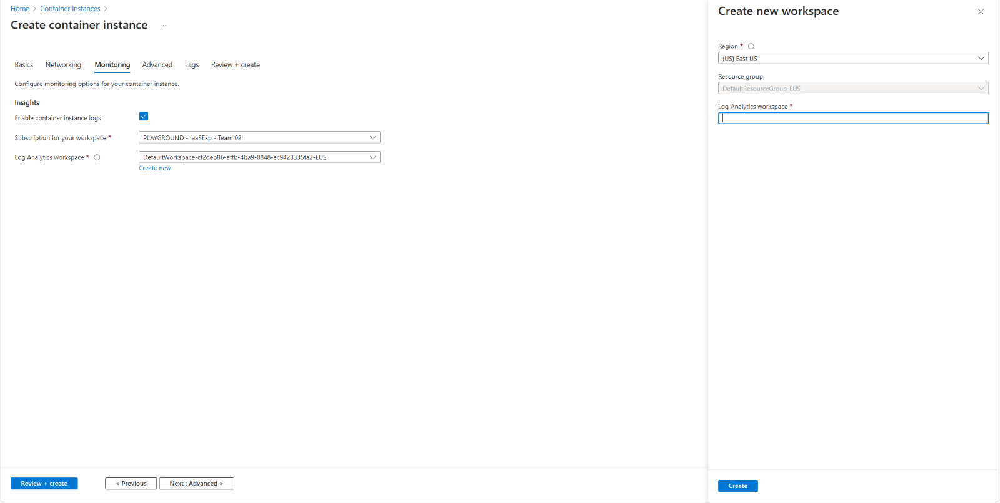
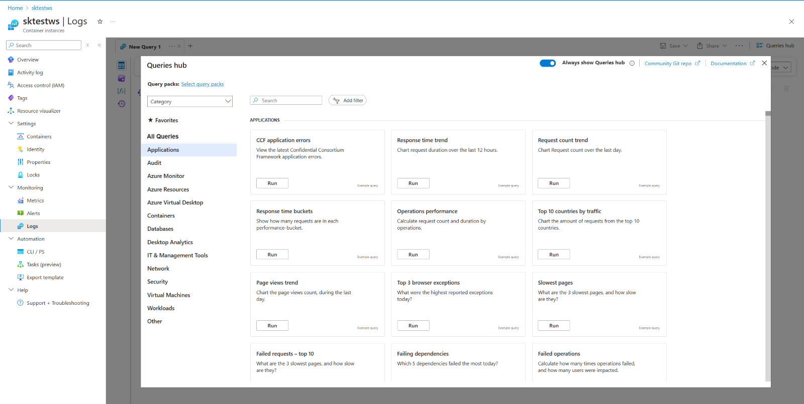
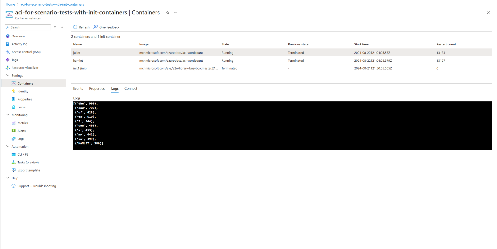

# View Container Group Logs in a Log Analytics Workspace via Azure Portal 

Log Analytics workspaces provide a centralized location for storing and querying log data not only from Azure resources, but also on-premises resources and resources in other clouds. Azure Container Instances includes built-in support for sending logs and event data to Azure Monitor logs. While creating a container instance within Azure Portal, you will be able to optionally set up Log Analytics. Once your container group is created with Log Analytics enabled you can view logs within the page for your Azure Container Instance by navigating to “Logs” on the left panel. If you didn’t set up Log Analytics initially, you can also navigate to “Logs” to set it up after you have already created your container instance also. 

The following sections describe how to set up logging and how to view logs for Azure Container Instances. 

## Create Azure Container Instance 

This section shows how to create a container instance with Log Analytics. 

> [NOTE!]
> Container instance logs are enabled by default. You can also set up Log Analytics later after you create your container instance by deselecting “Enable container instance logs”. The View Logs section has details on how to do this. 

1. Navigate to the create container instance page in Azure Portal 

2. Fill out the relevant information in the Basic and Networking tabs 

3. In the Monitoring tab, enable container instance logs 

If you have a Log Analytics workspace you can enter the information for it. 

 

If you do not have a Log Analytics workspace you can select “Create New” to create a new one. 

 

Lastly, fill out the following tabs then go to the “Review + Create” tab and click “Create” to create your container instance. 

## View Logs 

This section outlines how to view logs for your container instance that you created. 

1. Once your container instance is already created, click “Logs” on the left panel. 
 
 

2. You’ll see the Queries Hub where you can find queries to run in Log Analytics. If these are not needed, then you can close this screen. 

After closing the previous screen, if you created the ACI with the log-generating image, you should see data for your container group here. 
 

 
3. If you created a container instance without Log Analytics enabled, then you will see this screen and be able to enable it. 

You can enter an already existing Log Analytics workspace: 

 

You can also view logs for your container instances by navigating to “Containers” on the left pane, then selecting “Logs” in the middle pane. 

If your container instance is in running state, you’ll be able to see the logs: 
 

Now you’re ready to run your container group with Log Analytics. 

## Next Steps 

### Azure Monitor logs 

For more information about querying logs and configuring alerts in Azure Monitor logs, see: 

[Understanding log searches in Azure Monitor logs](https://learn.microsoft.com/azure/azure-monitor/logs/log-query-overview)

[Unified alerts in Azure Monitor](https://learn.microsoft.com/azure/azure-monitor/alerts/alerts-overview)

### Monitor container CPU and memory 

For information about monitoring container instance CPU and memory resources, see: 

[Monitor Azure Container Instances](https://learn.microsoft.com/azure/container-instances/monitor-azure-container-instances)

 

 

 

 
